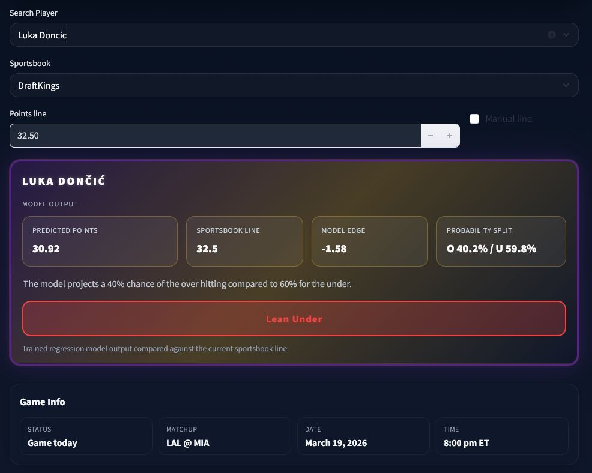
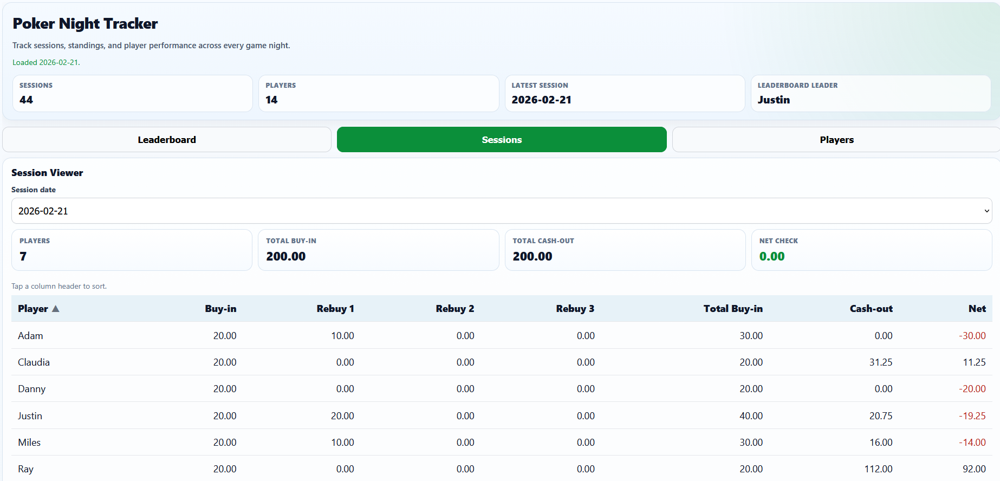
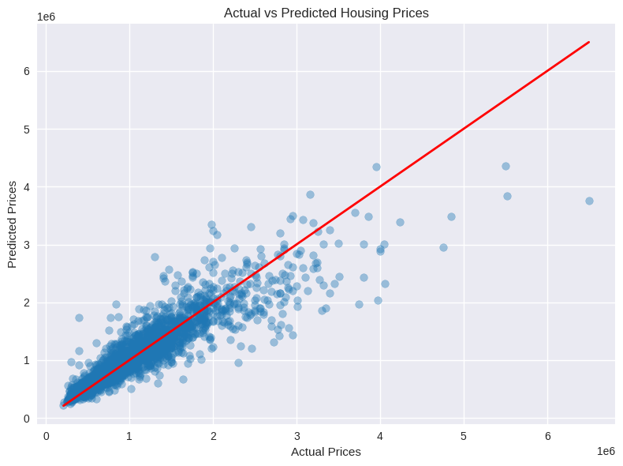

# Hi, I'm Richard Hanly

Digital Services Specialist and Software Development student focused on data analytics, machine learning, distributed systems, and backend development.

[nba-player-performance-prediction](https://github.com/richardrhanly-us/nba_player_performance_prediction)/n
[poker-night-tracker](https://github.com/richardhanly-us/poker-night-tracker)/n
[melbourne-housing-price-prediction](https://github.com/richardrhanly-us/melbourne-housing-price-prediction)/n
[shakespeare-hadoop-tfidf](https://github.com/richardrhanly-us/shakespeare-hadoop-tfidf/n
---

## Skills

**Languages**

- Python
- Java
- SQL

**Technologies**

- Hadoop / MapReduce
- Linux
- Git / GitHub

**Data & ML**

- Data Analysis
- Machine Learning
- Feature Engineering
- Exploratory Data Analysis

---

## Featured Projects

### NBA Player Performance Prediction (Machine Learning + Web App)

End-to-end machine learning project that predicts NBA player scoring and evaluates betting props using real-time data.

This project combines:
- Feature engineering from player game logs
- Regression modeling for stat prediction
- Probability modeling for betting analysis
- A live interactive web application

### Project Highlights

#### NBA Prop Prediction App

  

Repository  
[nba-player-performance-prediction](https://github.com/richardrhanly-us/nba_player_performance_prediction)

Live App  
https://nbaplayerperformanceprediction-7ajdpm4cmafadrmuczbvyf.streamlit.app/

---

### Poker Night Tracker (Full Stack Web App)

A full-stack poker session tracking system built using Google Apps Script and Google Sheets, featuring real-time data processing, player analytics, and a custom mobile-friendly UI.

  

This project combines:
- Structured data modeling using Google Sheets as a database
- Backend API development with Google Apps Script
- Interactive frontend UI with JavaScript, HTML, and CSS
- Data validation and automated session processing
- Player analytics with charts, aggregates, and filtering

### Project Highlights

#### Leaderboard & Player Dashboard

  

- Dynamic leaderboard with filtering (minimum games played)
- Player performance dashboard with:
  - Running profit visualization
  - Averages and totals
  - Year-in-review breakdowns
- Medal system for top 3 players
- Clickable leaderboard → player profiles

#### Sessions & Data Pipeline

  

- Structured session entry workflow
- Automated data validation and normalization
- Migration from unstructured sheets → relational format
- Google Drive integration for scanned game sheets

Repository  
[poker-night-tracker](https://github.com/richardhanly-us/poker-night-tracker)

Live App  
[https://script.google.com/macros/s/YOUR_DEPLOYMENT_ID/exec](https://tinyurl.com/78666poker)

---

### Melbourne Housing Price Prediction (Machine Learning)

End-to-end machine learning project analyzing housing market data and predicting property prices using Random Forest regression.

Project includes:

- Data cleaning and preprocessing
- Exploratory data analysis and visualization
- Feature engineering and encoding
- Linear Regression baseline model
- Random Forest regression model
- Hyperparameter tuning
- Model evaluation and comparison
- Feature importance analysis

### Project Highlights

#### Housing Price Prediction Visualization

 
Repository  
[melbourne-housing-price-prediction](https://github.com/richardrhanly-us/melbourne-housing-price-prediction)

---

### Distributed Text Analytics with Hadoop MapReduce

A distributed pipeline that analyzes Shakespeare plays using Hadoop MapReduce and TF-IDF scoring to identify important terms across a corpus.
  
Repository  
[shakespeare-hadoop-tfidf](https://github.com/richardrhanly-us/shakespeare-hadoop-tfidf)

---

## Contact

Email  
richardrhanly@gmail.com

LinkedIn  
www.linkedin.com/in/richardhanly
