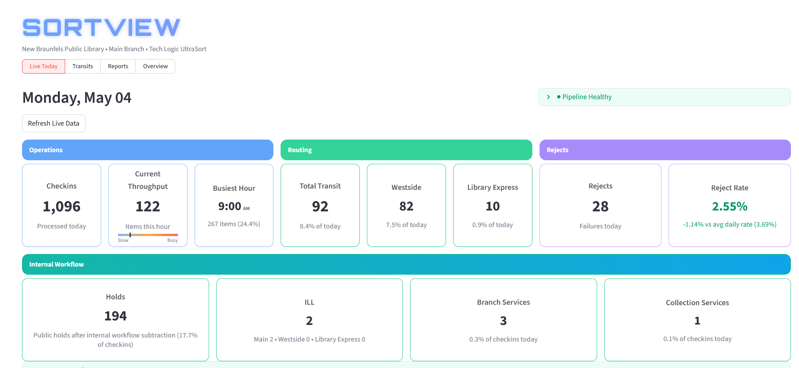
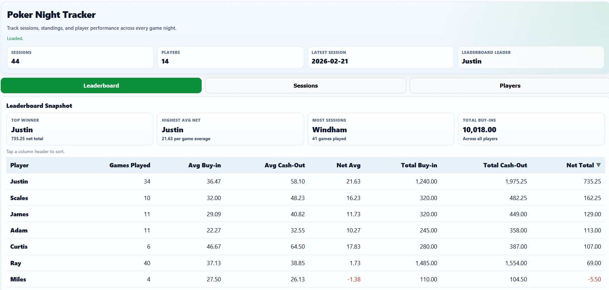
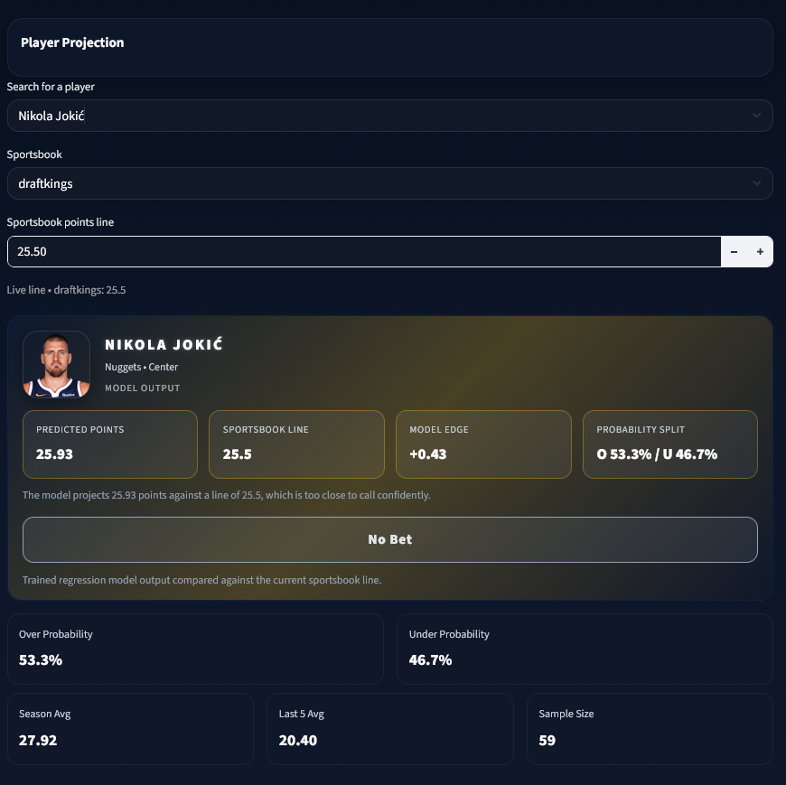
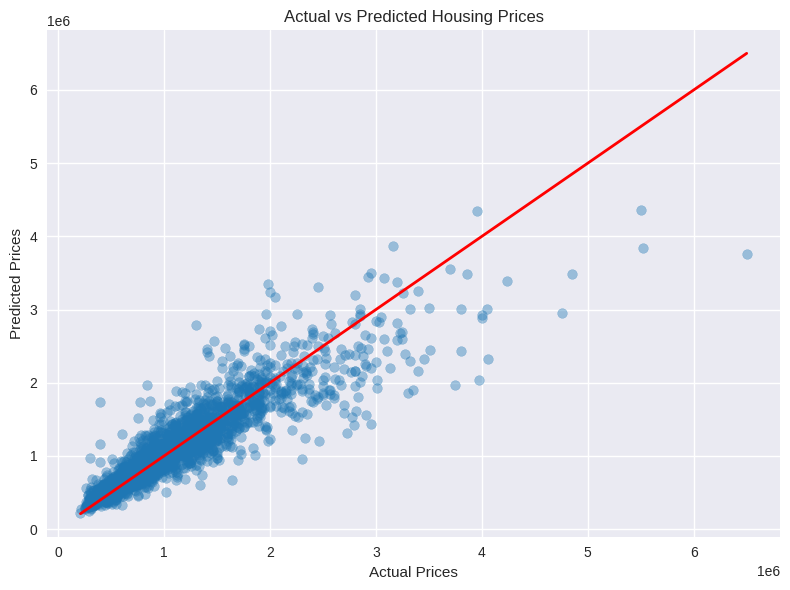

# Hi, I'm Richard Hanly

Digital Services Specialist and Software Development student building full-stack applications, data pipelines, and machine learning systems with real-world data.

---

## Skills

**Languages**

- Python      
- Java        
- SQL
- HTML
- C++
  
**Technologies**

- Hadoop / MapReduce
- Linux
- Git / GitHub

**Data & ML**

- Data Analysis
- Machine Learning
- Feature Engineering
- Exploratory Data Analysis

## Project links
- [SortView amh-analytics-dashboard](https://github.com/richardrhanly-us/amh-analytics-dashboard)
- [poker-night-tracker](https://github.com/richardrhanly-us/poker-night-tracker)
- [nba-player-performance-prediction](https://github.com/richardrhanly-us/NBA_Player_Performance_Data_Pipeline)
- [melbourne-housing-price-prediction](https://github.com/richardrhanly-us/melbourne-housing-price-prediction)
- [shakespeare-hadoop-tfidf](https://github.com/richardrhanly-us/shakespeare-hadoop-tfidf)

---

## Featured Projects

### SortView AMH Analytics Dashboard (Full Stack Data Pipeline + Dashboard)

Full-stack analytics platform for ingesting, storing, and visualizing Automated Materials Handler activity for a multi-branch library system.

Built with Python, FastAPI, Streamlit, PostgreSQL/Neon, and a Windows-side AMH agent that processes real sorter log data.

Key features:
- Windows AMH agent that reads local Tech Logic UltraSort and TLC log files
- Incremental data pipeline for check-ins, rejects, ACS events, and pipeline status
- FastAPI backend for authenticated uploads from branch machines
- PostgreSQL/Neon database used as the system-of-record
- Streamlit dashboard for live operational metrics, reject analysis, transit tracking, and alerts
- Multi-tenant architecture designed for customer, branch, and agent-token management
- Alembic migration tracking for database schema changes

  

Repository  
[SortView amh-analytics-dashboard](https://github.com/richardrhanly-us/amh-analytics-dashboard)

Live App  
[SortView](https://sortview.streamlit.app/)

---

### Poker Night Tracker (Full Stack Web App)

Full-stack analytics application for tracking poker sessions, player performance, and long-term profitability using real-world data.

Built with Google Apps Script, Google Sheets (as a relational data store), and a custom mobile-friendly frontend.

Key features:
- End-to-end data pipeline from raw session entry → normalized database tables
- Dynamic leaderboard with filtering (minimum games threshold)
- Player analytics dashboard with running profit visualization and trend charts
- Year-over-year performance breakdowns
- Clickable leaderboard → player drill-down navigation
- Google Drive integration for scanned session records
- Automated validation to ensure financial accuracy across sessions

  

Repository  
[poker-night-tracker](https://github.com/richardrhanly-us/poker-night-tracker)

Live App  
[Poker Night Tracker](https://tinyurl.com/78666poker)

---

### NBA Player Performance Prediction Pipeline(Machine Learning + Web App)

Machine learning system for predicting NBA player scoring and evaluating betting opportunities using real-time data.

Key features:
- Feature engineering from historical player game logs
- Regression modeling for stat prediction
- Probability modeling for over/under betting analysis
- Interactive Streamlit web application
- Real-time odds comparison against model projections

  

Repository  
[nba-player-performance-prediction](https://github.com/richardrhanly-us/NBA_Player_Performance_Data_Pipeline)

Live App  
[NBA Player Performance Prediction](https://edgeanalyticsnba.streamlit.app/)

---

### Melbourne Housing Price Prediction (Machine Learning)

End-to-end regression modeling project analyzing housing data and predicting property prices.

Key features:
- Data cleaning and preprocessing pipeline
- Exploratory data analysis and visualization
- Feature engineering and encoding
- Linear Regression baseline + Random Forest model
- Hyperparameter tuning and model evaluation
- Feature importance analysis

  

Repository  
https://github.com/richardrhanly-us/melbourne-housing-price-prediction

---

### Distributed Text Analytics with Hadoop MapReduce

Distributed data processing pipeline analyzing Shakespeare texts using Hadoop MapReduce.

Key features:
- Parallel text processing across distributed nodes
- TF-IDF implementation for term importance scoring
- Custom MapReduce jobs for scalable data analysis

Repository  
https://github.com/richardrhanly-us/shakespeare-hadoop-tfidf

---

## Contact

Email  
richardrhanly@gmail.com

LinkedIn  
www.linkedin.com/in/richardhanly
